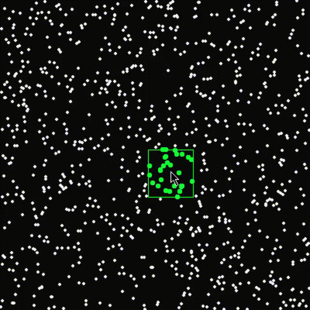

# QuadTree
I made quad tree in C. if you move your mouse around, a rectangle will follow and highlight every point within it.

 [](giphy.gif)

# Requirements

### You need to install:
- Raylib: https://www.raylib.com/

# How to run

type in this command:
</br>
```
gcc main.c QuadTree.c Point.c -o out -O1 -Wall -std=c99 -Wno-missing-braces -I .\include\ -L .\lib\ -lraylib -lopengl32 -lgdi32 -lwinmm
./out
```

# Controls

- to reveal the quad tree you press <kbd>Tab</kbd>
